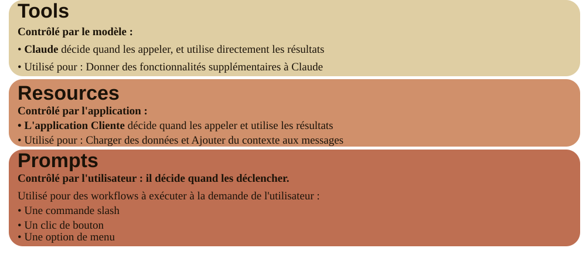

# MCP Chat (Java)

Version Java de l'exercice Python "MCP Chat" (cours *Introduction to Model Context Protocol*).

Application en ligne de commande permettant de discuter avec un modèle Claude via l'API Anthropic, avec recuperation de documents, prompts commandes et outils exposés via un serveur MCP (Model Context Protocol).

## Prérequis

- JDK 21+
- Maven 3.9+
- Une cle API Anthropic

## Mise en place

### Étape 1 : variables d'environnement

Créer le fichier `.env` a la racine du projet :

```
CLAUDE_MODEL="claude-sonnet-4-5"
ANTHROPIC_API_KEY=""   # Renseignez votre clé secrete Anthropic
```

### Étape 2 : compiler le projet

```
mvn clean compile
```

### Étape 3 : lancer le projet

```
mvn exec:java ou mvn clean compile exec:java (si l'étape 2 n'a pas été exécuté)
```
---

#### Important : 

Utilisez bien `mvn clean compile exec:java` (et non `mvn exec:java` seul).

Le serveur MCP applicatif est lancé comme sous-processus Java, dont le classpath
est materialise dans `target/classpath.txt` via le plugin `maven-dependency-plugin` qui
execute a la phase `generate-sources`. 

Laquelle ne s'execute que si `compile` (ou une phase posterieure) fait partie de la commande.

Pour plus de détails, voir les commentaires du fichier pom.xml

---

## Utilisation

### Interaction de base

Une fois l'application lancée, tapez simplement votre message et appuyez sur Entree pour discuter avec le modele.

### Recuperation de documents

Utilisez le symbole `@` suivi d'un identifiant de document pour inclure son contenu dans votre requête :

```
> Tell me about @deposition.md
```

### Commandes

Utilisez le préfixe `/` pour executer une commande définie par le serveur MCP :

```
> /summarize deposition.md
```

Les commandes s'auto-complètent quand vous appuyez sur Tab (via JLine, l'équivalent Java de prompt-toolkit).

## Les trois primitives MCP

Chaque primitive du serveur MCP est contrôlée par une couche différente de l'application, et sert un objectif différent :

- **Tools** — contrôlés par le modèle. C'est Claude qui décide, pendant son raisonnement, s'il a besoin d'appeler tel tool pour accomplir une tâche (ex. `read_doc_contents`, `modify_doc_contents`).
- **Resources** — contrôlées par l'application cliente. C'est le code du client (`CliChat`) qui décide quand aller chercher une resource, typiquement pour peupler l'autocomplétion ou enrichir un prompt de contexte avant l'envoi à Claude (ex. `docs://documents`, `docs://documents/{doc_id}`).
- **Prompts** — contrôlés par l'utilisateur. Ce sont des workflows prédéfinis déclenchés explicitement via une action utilisateur, comme nos commandes `/format` et `/summarize`.

En résumé : les tools servent le modèle, les resources servent l'application, les prompts servent l'utilisateur.



## Tests et Débogage avec MCP Inspector

[MCP Inspector](https://github.com/modelcontextprotocol/inspector) est indépendant du langage : il lance
le serveur comme process enfant et communique en JSON-RPC via stdio, ce qui fonctionne aussi bien avec
`McpServerApp` qu'avec un serveur Python ou Node.

Un jar exécutable (avec toutes les dépendances incluses) est généré via le plugin `maven-shade-plugin`,
ce qui évite les soucis de classpath :

```
mvn clean package
npx @modelcontextprotocol/inspector java -jar target/mcp-chat-server.jar
```

L'UI de l'Inspector s'ouvre sur `http://localhost:6274` : vous pouvez y lister et appeler individuellement
les tools, resources et prompts du serveur, sans passer par le client CLI complet. Pratique pour tester

## Structure du projet

```
cli_project_java/
├── pom.xml
├── .env
├── src/main/java/com/formation/mcpchat/
│   ├── Main.java              (equivalent de main.py)
│   ├── MCPClient.java         (equivalent de mcp_client.py — TODOs a completer)
│   ├── McpServerApp.java      (equivalent de mcp_server.py — TODOs a completer)
│   └── core/
│       ├── Claude.java        (equivalent de core/claude.py)
│       ├── Chat.java          (equivalent de core/chat.py)
│       ├── CliChat.java       (equivalent de core/cli_chat.py)
│       ├── ToolManager.java   (equivalent de core/tools.py)
│       └── Cli.java           (equivalent de core/cli.py)
```

## Développement

### Ajouter de nouveaux documents

Éditez `McpServerApp.java` pour ajouter des documents dans la Map `DOCS`.

### Implementer les fonctionnalités MCP

Pour terminer l'implémentation du protocole MCP :

1. Complétez les TODOs dans `McpServerApp.java` (outils, resources, prompts côté serveur)
2. Complétez les TODOs dans `MCPClient.java` (appels au serveur cote client)

### Dependances principales

- `com.anthropic:anthropic-java` — SDK Java officiel pour l'API Claude
- `io.modelcontextprotocol.sdk:mcp` — SDK Java officiel du Model Context Protocol
- `org.jline:jline` — boucle CLI interactive avec auto-completion
- `io.github.cdimascio:dotenv-java` — chargement du fichier `.env`

### Lint et verification de types

Aucun outil de lint/format n'est configuré (equivalent au projet Python d'origine). La verification de types est assurée nativement par le compilateur Java.

## Notes sur la conversion depuis Python

- Le typage dynamique de Python (`Any`, dictionnaires bruts pour les messages) a ete remplace par les types forts du SDK Java Anthropic/MCP (`MessageParam`, `McpSchema.Tool`, `ReadResourceResult`, etc.).
- prompt-toolkit n'existe pas en Java : la boucle interactive et l'auto-completion `/` et `@` sont reproduites avec **JLine**.
- python-dotenv est remplacé par **dotenv-java**.
- Le serveur MCP (`McpServerApp`) est lancé comme sous-processus Java avec son classpath materialise dans `target/classpath.txt`, ce qui évite d'avoir à gérer deux artefacts sépares (equivalent de `uv run mcp_server.py`).
